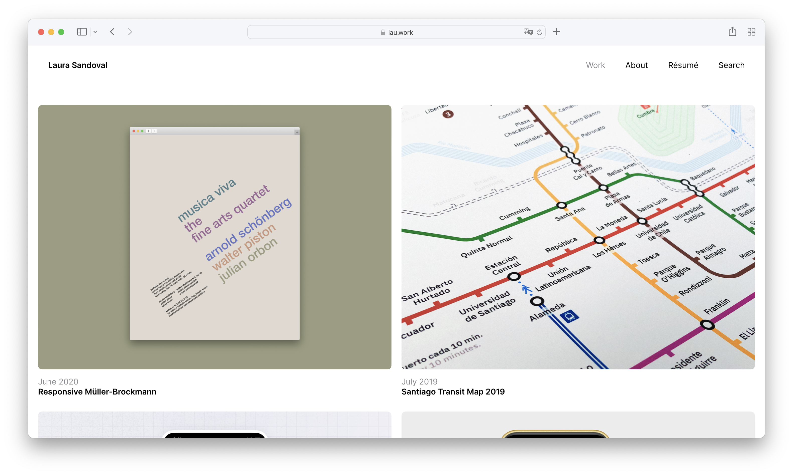

# Source code for `lausandoval.com`

This repository contains the source code for my own portfolio website, [lausandoval.com](https://lausandoval.com). This was a private repository for ~2 years, but I decided to make it public because why not.

## Design Background

Maintaining a portfolio is hard. No one has time for it, and yet you always want it to look fresh and new and exciting. With that in mind, I tried to follow some general design principles around that idea:
* Big, prominent artwork. As little text as possible.
* Accessible
* Easy to iterate and upload new things.
* Overall simplicity. Less is more (as cliché as it sounds).
* Curated work, not _in-your-face-here's-all-I've-ever-done_.
* _~~Powered by randomization, the portfolio should feel alive even if there's nothing new for a while.~~_ **Deprecated on [#2](https://github.com/laurasandoval/lau-portfolio/pull/2)**

## Features

### _~~Work Randomization~~_
_~~The main feature of my portfolio website is work randomization. Specifically, each session gets a "seed", which then determins the order of all my portfolio items using a [Linear Congruential Generator Algorithm](https://en.wikipedia.org/wiki/Linear_congruential_generator), all within a fixed set of featured and non-featured work items (following my own "Curated work" principle). In practice, this ensures that every time someone visits my portfolio it feels like there's new stuff, or something's changed – without me doing anything.~~_ **Deprecated on [#2](https://github.com/laurasandoval/lau-portfolio/pull/2)**

### _~~Artwork Randomization~~_
_~~Project artworks are also randomized each time you visit, although they're not tied to any fancy algorithm because I didn't have time to build that. This feature also serves the general purpose of the portfolio feeling _alive_.~~_ **Deprecated on [#2](https://github.com/laurasandoval/lau-portfolio/pull/2)**

### Bézier Curves
This one is my personal favorite. Apart from a few exceptions, most border-radiuses on this website use bézier curves (aka. [squircles](https://lausandoval.com/squircles.png)) using [a technique](https://github.com/laurasandoval/lau-portfolio/blob/26bd4f53fbdd533508bf3a7f33e022003ec742de/src/Components/ProjectThumbnail/index.scss#L48) I developed along with my friend [Matías](https://github.com/matmartinez), which basically consists of a combination of [9-slice scaling](https://en.wikipedia.org/wiki/9-slice_scaling) and [image masking](https://developer.mozilla.org/en-US/docs/Web/CSS/mask-image) using a base SVG and three lines of vanilla CSS. It's wonderful. A dream come true.

### Cute Animations
Go to the "About" page. Try opening the site on your phone and hitting the three lines. Cute, I hope!

***

## Contributing
Consider changing something here as changing something in someone else's house. If you feel strongly about it, sure, send me a pull request. But it'll still be my house so I don't promise I'll ever review it or merge it. Thanks though.

## Permissions and Stuff
Please don't use any of this code for any type of commercial or malicious purposes. Thanks :)

## Boring, Technical Stuff

This is literally stuff that came baked-in on this README file after I ran [`create-next-app`](https://github.com/vercel/next.js/tree/canary/packages/create-next-app) so there you go:

<i>
This is a [Next.js](https://nextjs.org/) project bootstrapped with [`create-next-app`](https://github.com/vercel/next.js/tree/canary/packages/create-next-app).

### Getting Started

First, run the development server:

```bash
npm run dev
# or
yarn dev
# or
pnpm dev
```

Open [http://localhost:3000](http://localhost:3000) with your browser to see the result.

You can start editing the page by modifying `pages/index.js`. The page auto-updates as you edit the file.

[API routes](https://nextjs.org/docs/api-routes/introduction) can be accessed on [http://localhost:3000/api/hello](http://localhost:3000/api/hello). This endpoint can be edited in `pages/api/hello.js`.

The `pages/api` directory is mapped to `/api/*`. Files in this directory are treated as [API routes](https://nextjs.org/docs/api-routes/introduction) instead of React pages.

This project uses [`next/font`](https://nextjs.org/docs/basic-features/font-optimization) to automatically optimize and load Inter, a custom Google Font.

### Learn More

To learn more about Next.js, take a look at the following resources:

- [Next.js Documentation](https://nextjs.org/docs) - learn about Next.js features and API.
- [Learn Next.js](https://nextjs.org/learn) - an interactive Next.js tutorial.

You can check out [the Next.js GitHub repository](https://github.com/vercel/next.js/) - your feedback and contributions are welcome!

### Deploy on Vercel

The easiest way to deploy your Next.js app is to use the [Vercel Platform](https://vercel.com/new?utm_medium=default-template&filter=next.js&utm_source=create-next-app&utm_campaign=create-next-app-readme) from the creators of Next.js.

Check out our [Next.js deployment documentation](https://nextjs.org/docs/deployment) for more details.
</i>